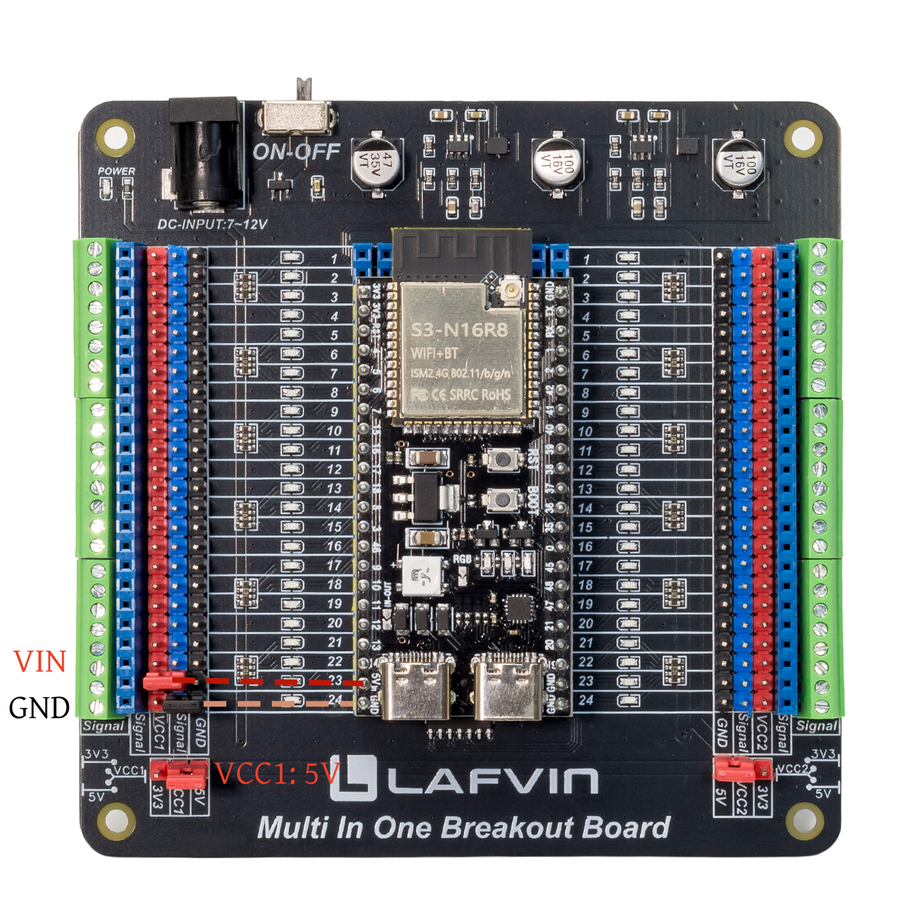

Compatible Development Boards
============================

- The LAFVIN Multi-in-One Breakout Board features a universal design that supports various development boards with a standard 100mil (2.54mm) dual-row pin layout and widths ranging from 600mil to 1000mil (15.24mm to 25.4mm); it is compatible with popular platforms such as Arduino Nano, ESP32, ESP8266, and Raspberry Pi Pico.

- This section uses the Arduino Nano, ESP32, ESP8266, ESP32-S3, and Raspberry Pi Pico as examples for demonstration.

.. attention::

 - The development board shown in this section is for demonstration purposes only and is not included as a standard accessory; it can be purchased separately if needed.
 
 - Power pin assignments may vary between development boards from different manufacturers; please refer to the specifications of the specific board you are using.
 
 - Please carefully identify the power pins before making connections to avoid damaging the development board.

----

ESP32-S3
--------

- Compatible with most ESP32-S3 series modules—including the ESP32-S3-WROOM and ESP32-S3-CAM—supporting both 42-pin and 44-pin configurations.

- The 44-Pin ESP32-S3-WROOM is used here for demonstration purposes.

**Connection Method**

The connection method to the breakout board is shown in the figure below:

.. raw:: html

   

