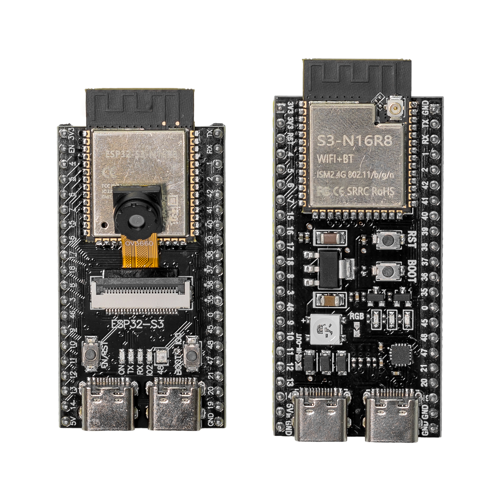
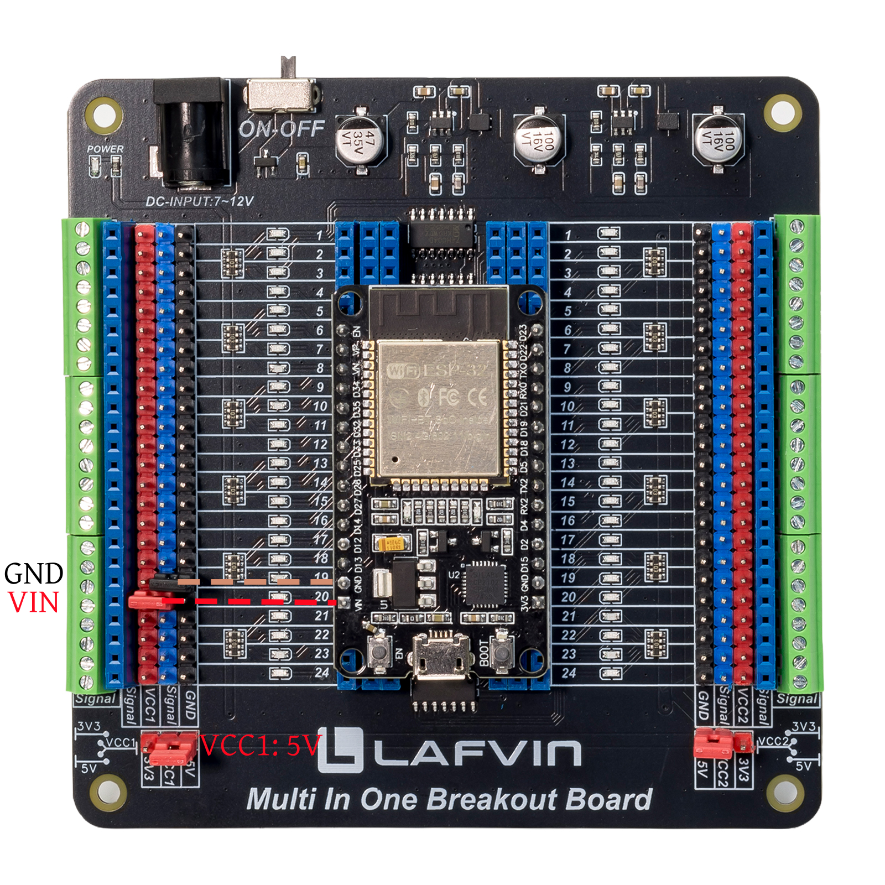
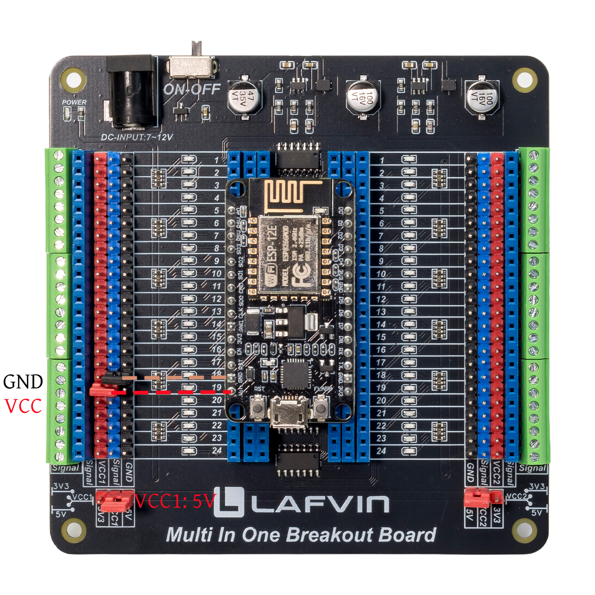
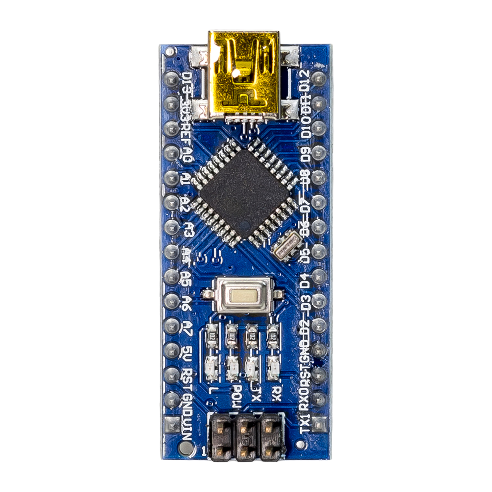
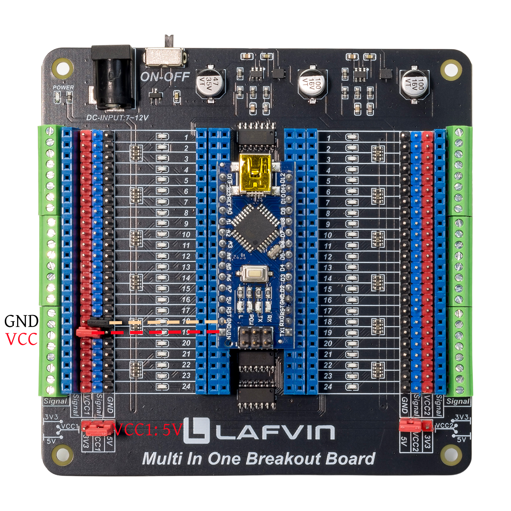

Compatible Development Boards
============================

- The LAFVIN Multi-in-One Breakout Board features a universal design that supports various development boards with a standard 100mil (2.54mm) dual-row pin layout and widths ranging from 600mil to 1000mil (15.24mm to 25.4mm); it is compatible with popular platforms such as Arduino Nano, ESP32, ESP8266, and Raspberry Pi Pico.

- This section uses the Arduino Nano, ESP32, ESP8266, ESP32-S3, and Raspberry Pi Pico as examples for demonstration.

.. attention::

 - The development board shown in this section is for demonstration purposes only and is not included as a standard accessory; it can be purchased separately if needed.
 
 - Power pin assignments may vary between development boards from different manufacturers; please refer to the specifications of the specific board you are using.
 
 - Please carefully identify the power pins before making connections to avoid damaging the development board.

----

1. ESP32-S3
-----------

.. raw:: html

   

- Compatible with most ESP32-S3 series modules—including the ESP32-S3-WROOM and ESP32-S3-CAM—supporting both 42-pin and 44-pin configurations.

- The 44-Pin ESP32-S3-WROOM is used here for demonstration purposes.

**Connection Method**

The connection method to the breakout board is shown in the figure below:

.. image:: _static/DevBoard/1.ESP32-S3.png
   :width: 800
   :align: center

.. raw:: html

   

**Example program**

.. note::

  - The example program in this tutorial is developed using the Arduino IDE; details regarding the use of this software are not covered here. 
  
  - If you need a beginner's guide, please click here to view it: `Arduino IDE <https://esp32-ultimate-starter-kit.readthedocs.io/en/latest/ArduinoTutorial.html>`_.

.. raw:: html

   

   

.. code-block:: cpp

 const int testPins[] = {
    4, 5, 6, 7, 15, 16, 17, 18, 8, 3, 46, 9, 10, 11, 12, 13, 14, 
    1, 2, 42, 41, 40, 39, 38, 37, 36, 35, 0, 45, 48, 47, 21, 20, 19
 };

 const int totalPins = sizeof(testPins) / sizeof(testPins[0]);

 void setup() {
    for (int i = 0; i < totalPins; i++) {
        pinMode(testPins[i], OUTPUT);
        digitalWrite(testPins[i], LOW);
    }
 }

 void loop() {
    // Forward direction
    for (int i = 0; i < totalPins; i++) {
        digitalWrite(testPins[i], HIGH);
        delay(500);
        digitalWrite(testPins[i], LOW);
    }
    
    // Backward direction
    for (int i = totalPins - 1; i >= 0; i--) {
        digitalWrite(testPins[i], HIGH);
        delay(500);
        digitalWrite(testPins[i], LOW);
    }
 }

.. raw:: html

   

   

     <button id="expand-btn-ESPS3" onclick="toggleCode('code-container-ESPS3', 'expand-btn-ESPS3')" style="flex: 1; padding: 10px 16px; background: #2980B9; color: white; border: none; border-radius: 4px; cursor: pointer; font-weight: bold;">▼ Expand All Code</button>
   

   

   

   

.. raw:: html

   

**Display Effect**

.. image:: _static/DevBoard/2.ESP32-S3.gif
   :width: 800
   :align: center

.. raw:: html

   

- The program sequentially illuminates the blue LED corresponding to each pin (setting the output to a high level) according to the order defined in the array.

- After remaining lit for 500 milliseconds, the LEDs turn off; the sequence then repeats in reverse order, continuing in an infinite loop.

.. note::

 - Each pin is equipped with a blue LED indicator to show the voltage status of the development board's pins. When you control a pin to output a high or low voltage, the indicator LED changes accordingly.

 - Similarly, if certain pins on the development board are unused, they remain in a floating state—potentially at a high or low voltage level—and the corresponding indicator LEDs on the board will light up or turn off accordingly.

 - The other compatible development boards introduced next also implement the same functionality.

----

2. ESP32
---------

.. image:: _static/DevBoard/3.ESP32.png
   :width: 800
   :align: center

.. raw:: html

   

- Compatible with most ESP32 series modules—including the ESP32-WROOM and ESP32-CAM development boards.

- The ESP32-WROOM will be used for demonstration purposes here.

**Connection Method**

.. raw:: html

   

**Example program**

.. raw:: html

   

   

.. code-block:: cpp

 const int testPins[] = {
    34, 35, 32, 33, 25, 26, 27, 14, 12, 13,
    23, 22, 21, 19, 18, 5, 4, 2, 15
 };

 const int totalPins = sizeof(testPins) / sizeof(testPins[0]);

 const int scanDelay = 500;

 void setup() {
    Serial.begin(115200);
    Serial.println("ESP32 Pin Scan Test Started");
    Serial.print("Total pins to test: ");
    Serial.println(totalPins);
    
    for (int i = 0; i < totalPins; i++) {
        pinMode(testPins[i], OUTPUT);
        digitalWrite(testPins[i], LOW);
        Serial.print("Pin ");
        Serial.print(testPins[i]);
        Serial.println(" initialized");
    }
    
    Serial.println("Setup complete. Starting scan loop...");
 }

 void loop() {

    for (int i = 0; i < totalPins; i++) {
        digitalWrite(testPins[i], HIGH);   
        delay(scanDelay);                   
        digitalWrite(testPins[i], LOW);    
    }
    
    delay(200);
    
    for (int i = totalPins - 1; i > -1; i--) {
        digitalWrite(testPins[i], HIGH);
        delay(scanDelay);
        digitalWrite(testPins[i], LOW);
    }

    delay(200);
 }

.. raw:: html

   

   

     <button id="expand-btn-ESP32" onclick="toggleCode('code-container-ESP32', 'expand-btn-ESP32')" style="flex: 1; padding: 10px 16px; background: #2980B9; color: white; border: none; border-radius: 4px; cursor: pointer; font-weight: bold;">▼ Expand All Code</button>
   

   

   

   

.. raw:: html

   

**Display Effect**

.. image:: _static/DevBoard/5.ESP32.gif
   :width: 800
   :align: center

.. raw:: html

   

----

3. ESP8266
-----------

   .. image:: _static/DevBoard/6.ESP8266.png
      :width: 800
      :align: center

   .. raw:: html

      

- Compatible with most ESP8266 (ESP-12E) series development boards.

**Connection Method**

.. raw:: html

   

**Example program**

.. raw:: html

   

   

.. code-block:: cpp

   const int testPins[] = {
    16,  // D0
    5,   // D1
    4,   // D2
    0,   // D3  
    2,   // D4
    14,  // D5
    12,  // D6
    13,  // D7
    15   // D8
 };

 const int totalPins = sizeof(testPins) / sizeof(testPins[0]);

 void setup() {
    for (int i = 0; i < totalPins; i++) {
        pinMode(testPins[i], OUTPUT);
        digitalWrite(testPins[i], LOW);
    }
 }

 void loop() {
    // Forward direction
    for (int i = 0; i < totalPins; i++) {
        digitalWrite(testPins[i], HIGH);
        delay(500);
        digitalWrite(testPins[i], LOW);
    }
    
    // Backward direction
    for (int i = totalPins - 1; i >= 0; i--) {
        digitalWrite(testPins[i], HIGH);
        delay(500);
        digitalWrite(testPins[i], LOW);
    }
 }

.. raw:: html

   

   

     <button id="expand-btn-ESP8266" onclick="toggleCode('code-container-ESP8266', 'expand-btn-ESP8266')" style="flex: 1; padding: 10px 16px; background: #2980B9; color: white; border: none; border-radius: 4px; cursor: pointer; font-weight: bold;">▼ Expand All Code</button>
   

   

   

   

.. raw:: html

   

**Display Effect**

.. image:: _static/DevBoard/8.ESP8266.gif
   :width: 800
   :align: center

.. raw:: html

   

----

4. Arduino Nano
---------------

.. raw:: html

   

- Compatible with most Arduino Nano series modules.

**Connection Method**

.. raw:: html

   

**Example program**

.. raw:: html

   

   

.. code-block:: cpp

 const int testPins[] = {
    2, 3, 4, 5, 6, 7, 8, 9, 10, 11, 12,  
    19, 18, 17, 16, 15, 14, 13                                      
 };

 const int totalPins = sizeof(testPins) / sizeof(testPins[0]);

 void setup() {
    for (int i = 0; i < totalPins; i++) {
        pinMode(testPins[i], OUTPUT);
        digitalWrite(testPins[i], LOW);
    }
 }

 void loop() {
    // Forward direction
    for (int i = 0; i < totalPins; i++) {
        digitalWrite(testPins[i], HIGH);
        delay(500);
        digitalWrite(testPins[i], LOW);
    }
    
    // Backward direction
    for (int i = totalPins - 1; i >= 0; i--) {
        digitalWrite(testPins[i], HIGH);
        delay(500);
        digitalWrite(testPins[i], LOW);
    }
 }

.. raw:: html

   

   

     <button id="expand-btn-ArduinoNano" onclick="toggleCode('code-container-ArduinoNano', 'expand-btn-ArduinoNano')" style="flex: 1; padding: 10px 16px; background: #2980B9; color: white; border: none; border-radius: 4px; cursor: pointer; font-weight: bold;">▼ Expand All Code</button>
   

   

   

   

.. raw:: html

 

**Display Effect**

.. image:: _static/DevBoard/11.ArduinoNano.gif
   :width: 800
   :align: center

.. raw:: html

   

----

5. Raspberry Pi Pico
----------------------

   .. image:: _static/DevBoard/12.RaspberryPiPico.png
      :width: 800
      :align: center

   .. raw:: html

      

   
- Compatible with most Arduino Nano series development boards.

