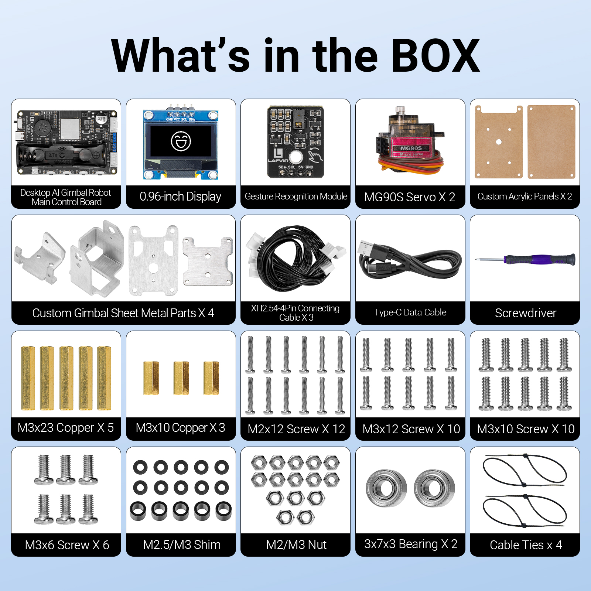
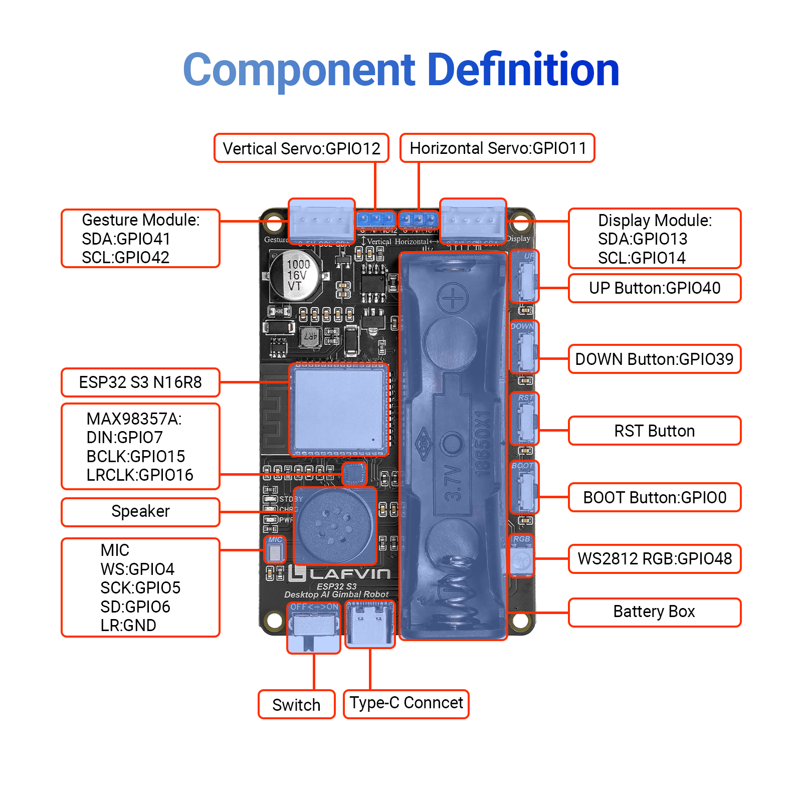

Introduction
============

**Dear friends, welcome to the learning world of the LAFVIN Multi In One Breakout Board!**

**Please read this documentation carefully. If you encounter any problems during use, please contact our after-sales support team, and we will assist you as soon as possible.**

----

**LAFVIN Multi In One Breakout Board**

.. image:: _static/Introduction/3.robot.png
   :width: 600
   :align: center

.. raw:: html

   

----

Bill of Materials
-----------------

.. raw:: html

   

.. list-table:: 
   :header-rows: 1
   :widths: 10 40 20
   :align: center

   * - Serial Number
     - Name
     - Quantity
   * - 1
     - Multi In One Breakout Board
     - x1
   * - 2
     - Jumper Cap (Short、Red) 
     - x5
   * - 3
     - Jumper Cap (Short、Black)
     - x5
   * - 4
     - Jumper Caps (Long、Red) 
     - x5
   * - 5
     - Jumper Cap (Long、Black) 
     - x5
   * - 6
     - M3x10 Copper Standoff
     - x4
   * - 7
     - M3x6 Screw
     - x4
   * - 8
     - Flathead Screwdriver
     - x1  

----

.. attention::

   Please check the contents of the package against the bill of materials. If you find any missing or damaged items, please contact our technical support team immediately.

Technical Parameters
--------------------

- **The figure below shows the component definitions for the main control board:**

.. raw:: html

   

.. list-table:: 
   :header-rows: 1
   :widths: 20 30
   :align: center

   * - Parameter
     - Value
   * - Input Voltage
     - One 18650 battery（3.7–4.2V）
   * - Operating Voltage
     - 3.3V-5V
   * - Charging Voltage
     - TYPE-C 5V/2A
   * - Main Control Chip
     - ESP32-S3 N16R8
   * - Power Amplifier Chip
     - MAX98357AETE+T
   * - Microphone Model
     - Digital I2S output
   * - Servo Model
     - MG90S Servo
   * - Screen Model
     - SSD1306 0.96 Inch OLED Display
   * - Gesture Module Signal
     - PAJ7620U2
   * - Speaker
     - 8Ω 1W

----

Function Introduction
---------------------

**Introduction:**

- This is a multi-functional development board expansion breakout board designed for developers, electronics enthusiasts, and educational experiments. It quickly expands the GPIO, power, and ground resources of commonly used development boards, facilitating the connection of sensors, actuators, display modules, and various electronic experimental components.

- The product features a universal design, supporting various 100mil (2.54mm) standard dual-row pin development boards with widths ranging from 600mil to 1000mil (15.24mm to 25.4mm), and is compatible with common development platforms such as Arduino Nano, ESP32, ESP8266, and Raspberry Pi Pico.

- With onboard power input, power switch, power indicator, GPIO status indicator, and various expansion interfaces, it makes setting up development board experiments simpler, safer, and more efficient.

**Features:**

- **Universal Compatibility Design, Adaptable to Multiple Development Boards**

 - Utilizes a wide-compatible interface design, supporting 100mil (2.54mm) dual-row pin development boards with widths of 600mil, 800mil, 900mil, and 1000mil.

 - Compatible with Arduino Nano, ESP32, ESP8266, Raspberry Pi Pico series, and other standard dual-row pin development boards. No complex adapters are required for quick expansion, meeting the development needs of various projects.

- **Abundant GPIO Expansion, Quick Connection to Peripheral Modules**

 - Through onboard expansion interfaces, the development board's GPIO, power, and ground wires are fully exposed, including: GPIO signal interfaces, 3.3V power supply, 5V power supply, and GND ground.

 - Also provides two-sided screw terminal interfaces, standard female header interfaces, and pin header expansion interfaces, supporting DuPont wire connections, breadboard experiments, and fixed wiring, making experimental setup more flexible and convenient.

- **Independent Indicator Light Design**

 - Onboard power LED indicator displays the current power supply status in real time, allowing for quick and easy determination of system functionality.

 - It also features GPIO status indicator lights, displaying high and low level changes of corresponding I/O ports, facilitating program debugging, signal detection, and hardware verification, making electronic experiments more intuitive.

- **Added Power Switch for Enhanced Safety and Convenience**

 - Compared to ordinary expansion boards, this product adds an independent ON/OFF sliding power switch, allowing control of the entire experimental system's power supply without frequent power plugging and unplugging. This enables quick power-off during program debugging, prevents accidental operation when modifying circuits, extends interface lifespan, and improves the development experience.

**Target audience or scenarios** 

- Suitable for electronics enthusiasts, students, teachers, makers, and embedded developers. It can be widely used in experiments with Arduino, ESP32, Raspberry Pi, Pico, and other development boards; IoT project development; robot building; smart home construction; STEM education; and electronic prototyping.

- Through convenient GPIO expansion and flexible connection methods, it helps users quickly build experimental circuits, improving development efficiency and suitable for various application needs from beginner learning to professional project development.

----

**Next, we will delve into the core content of the course and help you gradually understand the relevant concepts and master the operation procedures.**

----
